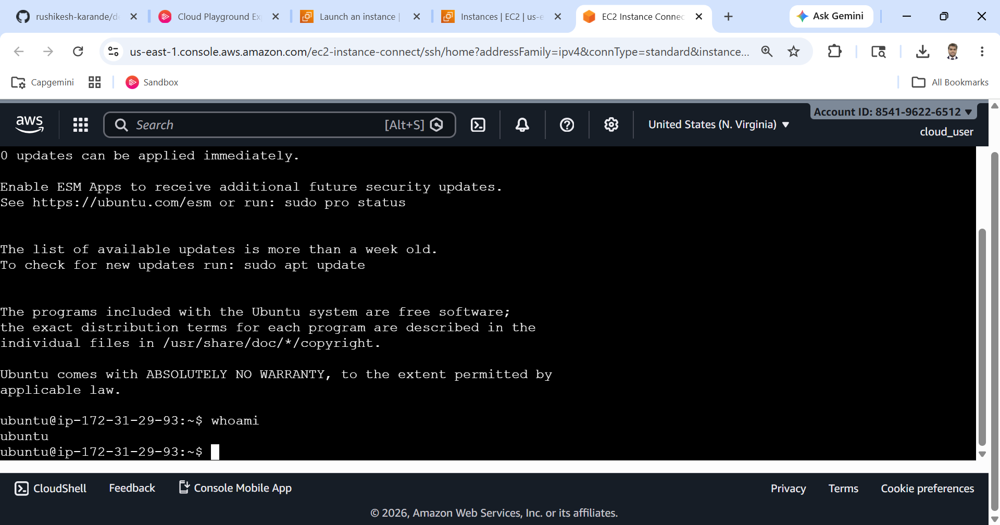
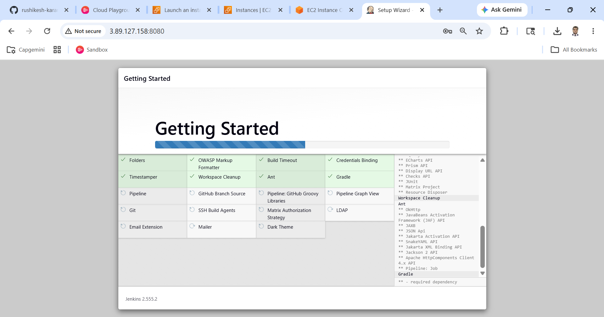
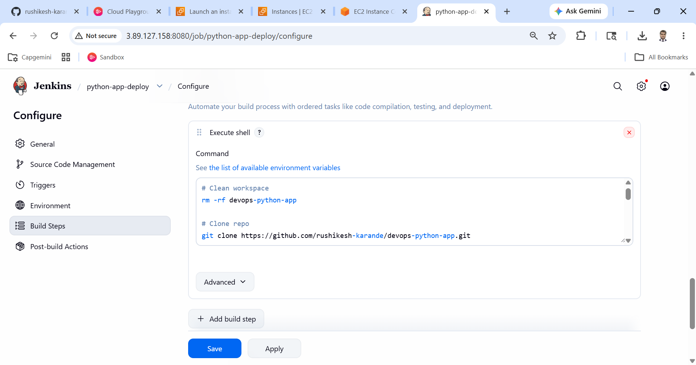
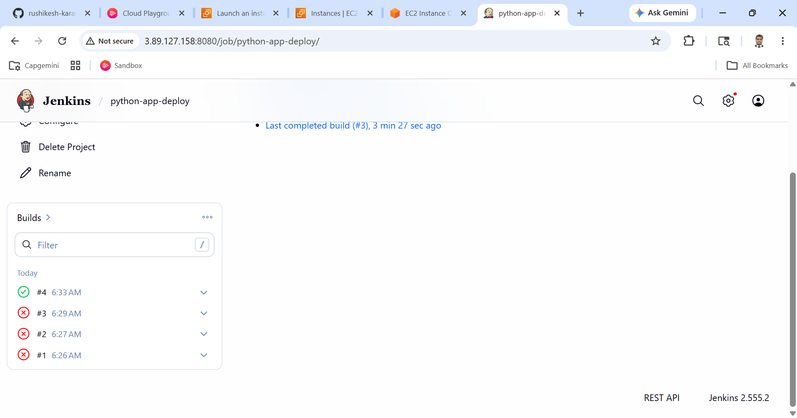
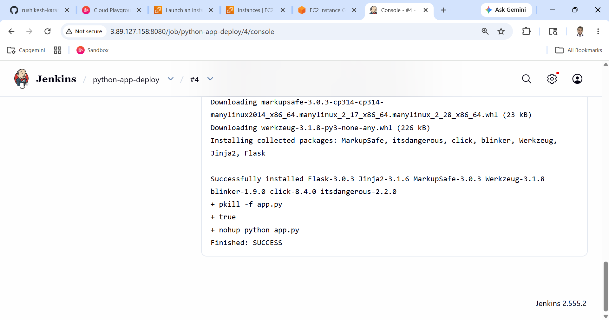
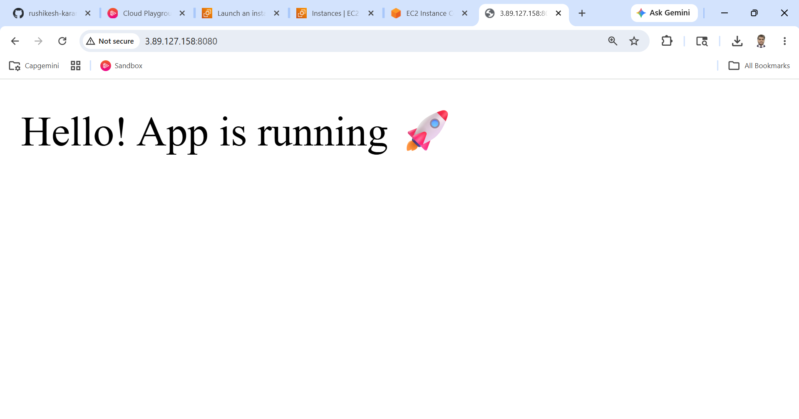

README Template - CI/CD Project 

 

# 🚀 CI/CD Pipeline using Jenkins, GitHub, and AWS EC2 
 
## 📌 Project Overview 
This project demonstrates an end-to-end CI/CD pipeline where a Python Flask application is automatically deployed to an AWS EC2 instance using Jenkins whenever changes are pushed to GitHub. 
 
--- 
 
## 🧠 Architecture 
 
``` 
GitHub → Jenkins → EC2 → Live Application 
``` 
 
--- 
 
## 🛠️ Tools & Technologies 
 
- GitHub (Version Control) 
- Jenkins (CI/CD Automation) 
- AWS EC2 (Cloud Server) 
- Python Flask (Application) 
- Git 
 
--- 
 
## 📂 Project Structure 
 
``` 
devops-python-app/ 
├── app.py 
├── requirements.txt 
├── README.md 
└── screenshots/ 
``` 
 
--- 
 
## 🖼️ Screenshots 
 
### 🔹 EC2 Instance Running 
 
 
--- 
 
### 🔹 Jenkins Dashboard 
 
 
--- 
 
### 🔹 Jenkins Job Configuration 
 
 
--- 
 
### 🔹 Jenkins Build Success 
 
 
--- 
 
### 🔹 Console Output 
 
 
--- 
 
### 🔹 Application Running Output 
 
 
--- 
 
 
## ✅ Final Result 
 
- CI/CD pipeline successfully implemented 
- Automatic deployment enabled using Jenkins 
- Python application running on EC2 
 
--- 
 
## 🎯 Key Learnings 
 
- CI/CD pipeline concepts 
- Jenkins automation 
- GitHub integration 
- AWS EC2 deployment 
- Debugging real-world DevOps issues 
 
--- 
 
## 👨‍💻 Author 
Rushikesh Karande 
 
